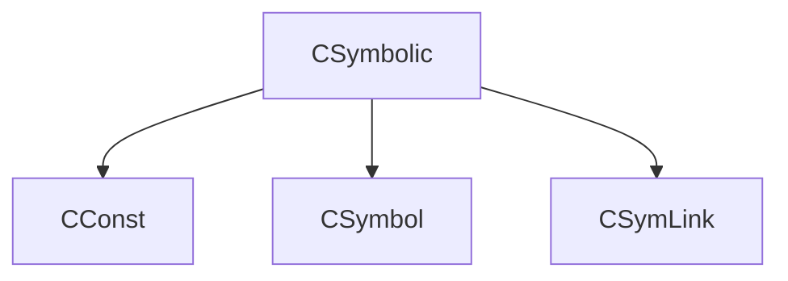

# Cereal C++ Examples
Here, you can find my working examples for serializing C++ classes with inheritance and polymorphism.

# Refs
[Cereal Github](https://github.com/USCiLab/cereal)
[Cereal Website](https://uscilab.github.io/cereal)
[Cereal Docs](https://uscilab.github.io/cereal/quickstart.html)
